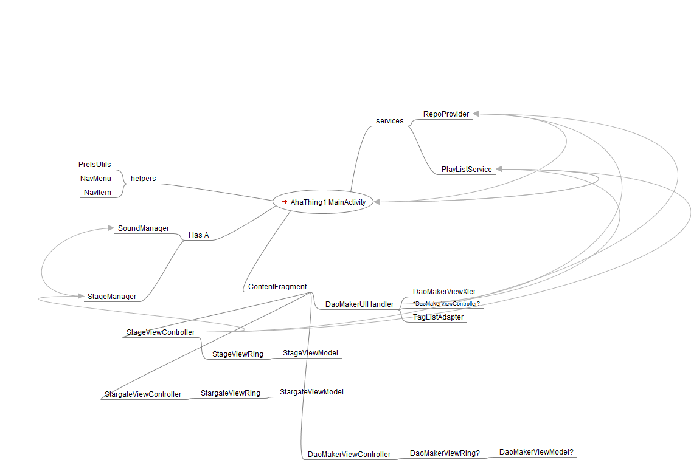
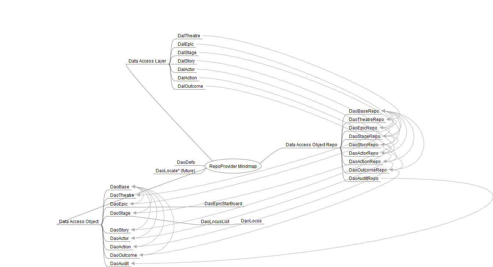

"all the world's a stage..."

M.A.Tucker
Winter/Spring 2018
===============================================================================
AhaTheatre is a framework for defining complex interactions through a series of object containers:

- Theatre - collections of Epics
- Epic - collections of Stories
- Story - Actor, Action, Outcome (optional pre-requisites, post-operation )
- Actor - human or object performing action for outcome
- Action - definition of action being performed by actor
- Outcome - definition of result or outcome of actor performing action
- Stage - arena where stories occur often changing as a result of actions/outcomes

Activities & Services:

- AhaThing1 - (apologies to Dr. Suess) Android activity framework
- RepoProvider - FireBase object hierarchy for distributed Theatre/Epic/Story performance
- ServiceProvider - maintains local playlist of activities on each device

M.A.Tucker
Winter/Spring 2017
===============================================================================
(origin myth)
Internet of Things apps often reference a hierarchy of things which may be viewed independently or as collections.

While a classic Master List/Detail View pattern may suffice for simple collections, 
the navigation drawer pattern has advantages in scaling & organizing the collections.

Short range goals:
- establish framework for creating, updating, removing, associating & navigating a dynamic object hierarchy
- establish Google Firebase as repository for securely sharing the object hierarchy
- establish several local services shared within app
- explore stage models
- exercise synchronized, concurrent & free form story execution

Mid-range goals:
- establish Google Firebase for notification, invitations, messaging, etc.  
- generate Google Firebase performance metrics
- evaluate impact of edge intelligence (cloud repository with no logic)
(Human Interaction)
- enable voice control to replace keyboard (audibility)
- enable audio recognition of objects (audibility)
- establish alternate representations of object vs text based attributes (visualibility)
- establish framework for record/playback
- explore gesture/voice interaction

Long-range goals:
- mirror gestures/voice comands on tablet to Virtual Reality engine (e.g. Galaxy phone)
- evaluate framework for Augmented Reality apps
- evaluate story execution vs IFTTT style scripting
- explore framework migration to a thing (e.g. Rapsberry Pi running AndroidThings?)
- enable ML analysis of story outcomes

(end of story)